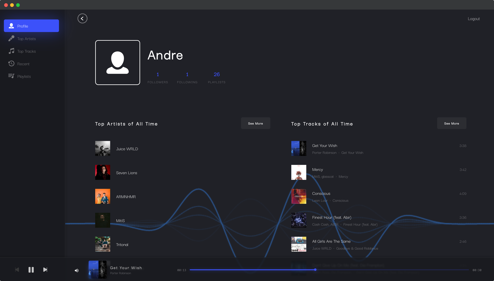

# Spotty

> A web app for visualizing personalized Spotify data.
> View your top artists, top tracks, recently played tracks, detailed audio information about each track, and an audio visualizer.

<p align="center">
  <a href="https://app.netlify.com/sites/spotty-profile/deploys" target="_blank">
    
  </a>
</p>




Built with:

-   [Spotify Web API](https://developer.spotify.com/documentation/web-api/)
-   [Next.js](https://www.nextjs.org/)
-   [Next-auth.js](https://next-auth.js.org/)
-   [Typescript](https://www.typescriptlang.org/)
-   [Howler.js](https://github.com/goldfire/howler.js/)
-   [Siri Wave](https://github.com/kopiro/siriwave)
-   [Framer Motion](https://www.framer.com/motion/)
-   [Styled Components](https://www.styled-components.com/)

## Getting Started

1. [Register a Spotify App](https://developer.spotify.com/dashboard/applications) and add `http://localhost:3000/api/auth/callback/spotify` as a Redirect URI in the app settings

2. Install and use the correct version of Node using [NVM](https://github.com/nvm-sh/nvm)

    ```sh
    nvm install
    ```

3. Install dependencies

    ```sh
    yarn
    ```

4. Start the development server

    ```bash
     yarn dev
    ```

5. Open [http://localhost:3000](http://localhost:3000) with your browser.
